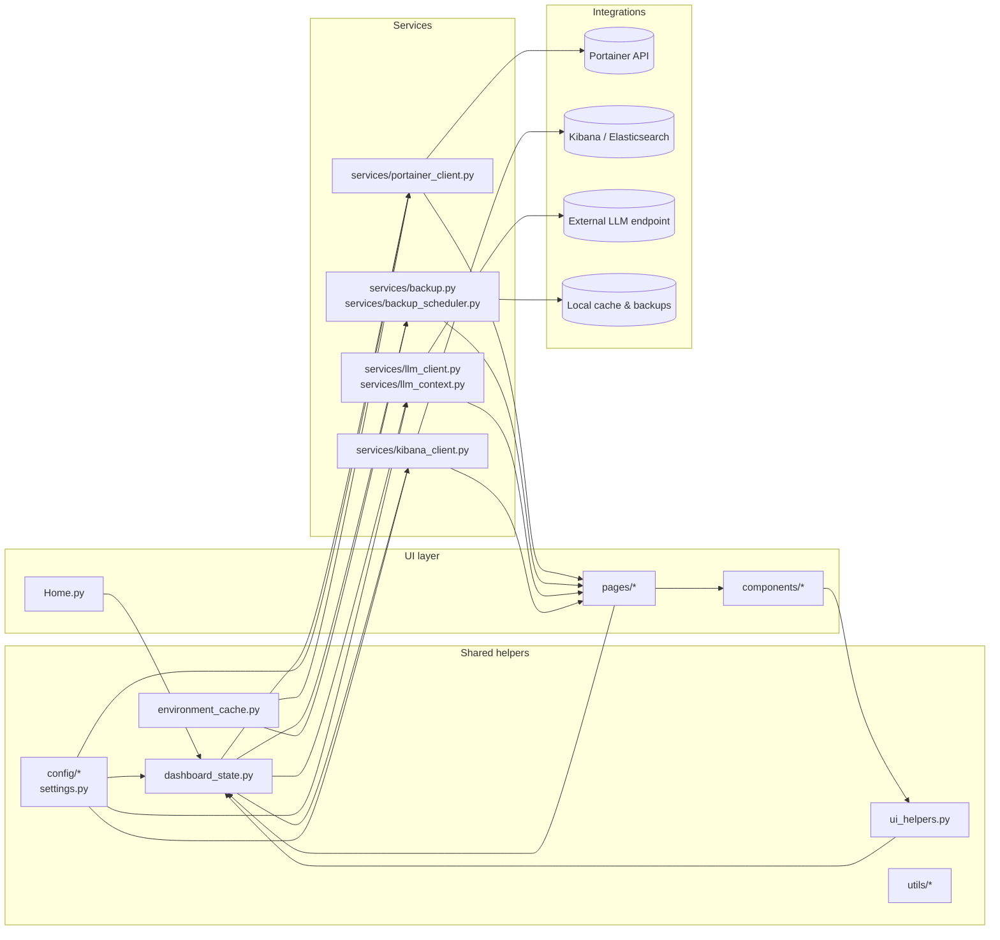

# Streamlit Portainer dashboard module boundaries

This guide captures the architectural intent of the dashboard so contributors can make changes without breaking the implicit contracts between modules.

## Module interaction diagram

## Ownership map

| Area | Location | Responsibilities | Primary steward |
| --- | --- | --- | --- |
| UI pages | `app/Home.py`, `app/pages/`, `app/components/` | Streamlit views, layout, widget orchestration, sidebar navigation | UI maintainers |
| Shared helpers | `app/dashboard_state.py`, `app/environment_cache.py`, `app/ui_helpers.py`, `app/utils/`, `app/config/`, `app/settings.py` | Centralised state management, caching, configuration resolution, generic utilities | Core maintainers |
| Services | `app/services/` | Typed integration clients, background jobs, domain-specific logic reused by multiple pages | Integrations maintainers |

> **Tip:** If you are unsure who owns a given area, tag the maintainers listed in `CODEOWNERS` (or repository admins) when opening a pull request.

## Contributor guidelines

### When to add a new page

Create a new entry in `app/pages/` when:

- Operators need a distinct workflow or navigation destination (it shows up as a new sidebar item).
- The UI would otherwise become unwieldy (for example combining unrelated Portainer domains into one page).
- You need to surface data sourced from a new integration and the experience warrants dedicated controls.

Prefer extending an existing page when the feature builds on the same Portainer view, reuses the current filters, and can be explained alongside the existing charts or tables. Use `app/components/` for reusable UI fragments so other pages can stay consistent.

### When to extend services or helpers

- Put API integrations, scheduled tasks, and data shaping inside `app/services/`. Pages should not talk to HTTP endpoints or long-running jobs directly.
- Add helper functions to `app/ui_helpers.py` or `app/utils/` only when they are UI-agnostic or reused by multiple Streamlit pages. Leave page-specific logic co-located with the page.
- Keep shared state and caching logic in `app/dashboard_state.py` and `app/environment_cache.py`. If you need new flags or cached collections, extend those modules instead of duplicating state inside the pages.
- Configuration knobs belong in `app/settings.py` or the appropriate `app/config/` module so they remain discoverable and testable.

### Adding new services or integrations

1. Model the client in `app/services/` with clear input/output types and docstrings.
2. Update the module diagram above if the new service connects to additional upstream systems.
3. Provide unit tests in `tests/` that exercise the new service in isolation.
4. Expose the functionality through the relevant page using the shared state helpers.

### Updating the diagram

Whenever you introduce new cross-cutting modules, update the Mermaid diagram so the interaction map stays accurate. The README links here, so contributors rely on this page to understand the latest boundaries.

## File naming conventions

- Streamlit pages follow the numeric prefix format (`N_Title.py`) so the sidebar ordering remains deterministic.
- Service modules use descriptive nouns (`kibana_client.py`, `backup_scheduler.py`), aligning with the functionality they encapsulate.
- Helper modules avoid prefixes like `new_` or `temp_`; prefer descriptive names that explain their intent.

Refer back to this document during reviews to ensure new code respects the boundaries between the UI, shared helpers, and services.
